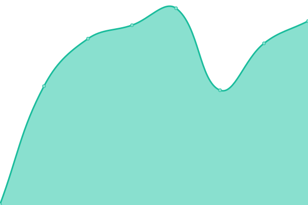

# [📈 Live Status](https://status.hendrikwagner.de): <!--live status--> **🟧 Partial outage**

<!--start: status pages-->
<!-- This summary is generated by Upptime (https://github.com/upptime/upptime) -->
<!-- Do not edit this manually, your changes will be overwritten -->
<!-- prettier-ignore -->
| URL | Status | History | Response Time | Uptime |
| --- | ------ | ------- | ------------- | ------ |
|  [Main Page](https://hendrikwagner.de) | 🟥 Down | [main-page.yml](https://github.com/hwgn/uptime/commits/HEAD/history/main-page.yml) | 

 189ms
     
 | 

<a href="https://status.hendrikwagner.de/history/main-page">0.00%</a>
    

|  [Docs Page](https://docs.hendrikwagner.de) | 🟩 Up | [docs-page.yml](https://github.com/hwgn/uptime/commits/HEAD/history/docs-page.yml) | 

 489ms
     
 | 

<a href="https://status.hendrikwagner.de/history/docs-page">100.00%</a>
    

<!--end: status pages-->
